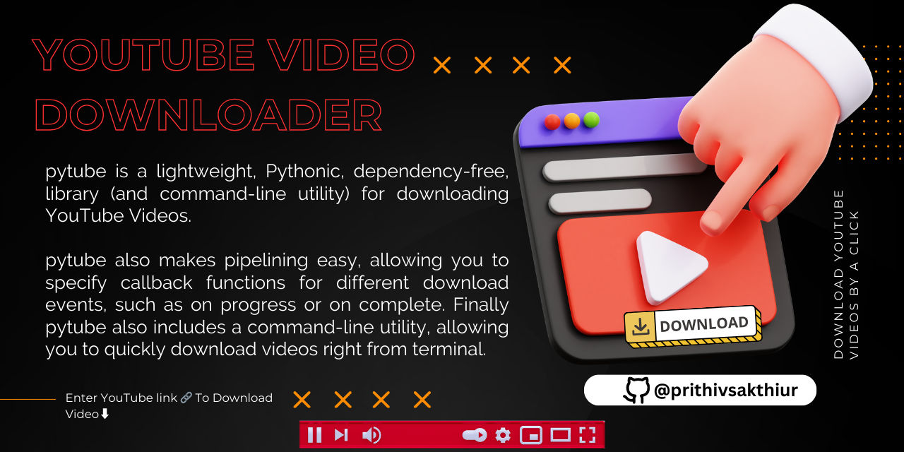
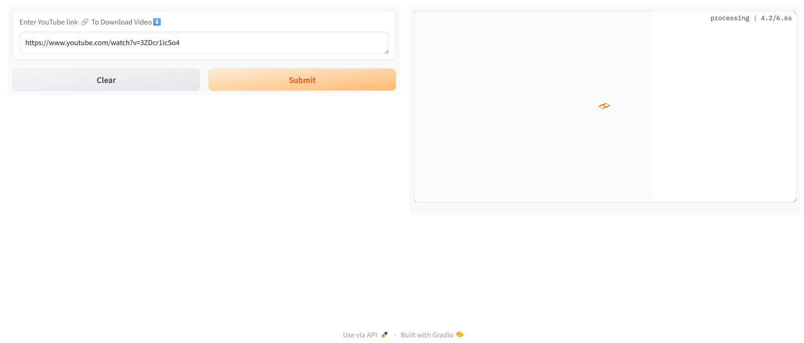

🪶Check out the configuration reference at https://huggingface.co/docs/hub/spaces-config-reference

🚀Huggingface space : https://huggingface.co/spaces/prithivMLmods/youtube-video-downloader

🚀To Clone Just Install Git Past the Command : git clone https://huggingface.co/spaces/prithivMLmods/youtube-video-downloader

## 📂➡️ Source URL for Getting Youtube Video:

## 🚀🥤Video to Download :

.

.

.

